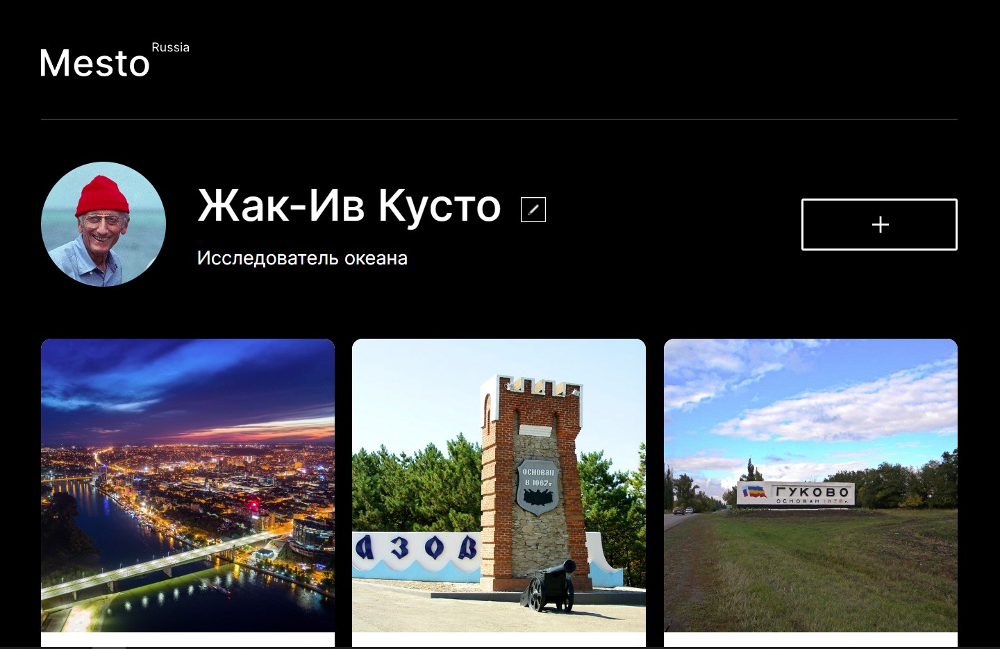

**Место"** 

Яндекс практикум "Веб-разработка"(Спринт 4)
## Применялись языки разметки :
**HTML:5 и CSS.**
## Применялись язык программирования :
**JS**
 ## В проекте задействованы технологи:
1. Flexbox;
2. Grid Layout
3. БЭМ;
4. Позиционирование;
5. Адаптивность
6. Плавность перехода;

[Проект на Github](https://markrnd.github.io/mesto/)

* [Ссылка на макет в Figma](https://www.figma.com/file/2cn9N9jSkmxD84oJik7xL7/JavaScript.-Sprint-4?node-id=0%3A1)